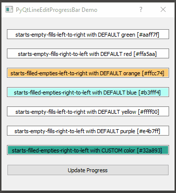

# PyQtLineEditProgressBar
 A custom PyQt widget that creates a configurable progress bar as the background color of a QLineEdit widget.

## Introduction ##
This widget sub-classes the [QLineEdit](https://doc.qt.io/qtforpython/PySide2/QtWidgets/QLineEdit.html) widget to add a progress bar as its background color.

Read the User Manual in the **docs/build/html/index.html** file for more details.

## Dependencies ##
PyQtLineEditProgressBar depends on the following third-party packages:

- [PyQt5](https://pypi.org/project/PyQt5/)

- [colour](https://pypi.org/project/colour/)

## Installation ##
Via Python's package installer:

	pip install PyQtLineEditProgressBar

or from the package source as a user:

	pip install . 

or from the package source as a developer:

	pip install -e .

## Testing ##
Once installed the **demo.py** file can be executed to demonstrate usage:

	python demo.py

The results of executing this file should look similar to the animation below.

 

## License ##

**PyQtLineEditProgressBar** is GPLv3 licensed. See **LICENSE** file for details.

## Attributions ##
This code is based off of a discussion at [StackOverflow](https://stackoverflow.com/questions/36972132/how-to-turn-qlineedit-background-into-a-progress-bar).

## Usage ##
Inspect the **demo.py** code for examples of how to use ** PyQtLineEditProgressBar**
and read the user manual documentation in the **docs/build/html/index.html** or online at the Read The Docs once I get it posted there.

## Caveat ##
This package uses Qt Palettes and LinearGradients to implement the progressbar in the background color of the LineEdit widget.

If you spend anytime whatsoever reading the Qt documentation on Palettes, it clearly states multiple times that the use of Palettes and Qt Style Sheets should not be mixed.

So its highly likely that if this package is used as part of an application that changes color themes via Qt Style Sheets there might be compatibility issues.

I would like to understand and solve this issue in the future, if possible. But at the moment it is not clear to me how to implement something like this only using Qt's style sheets.